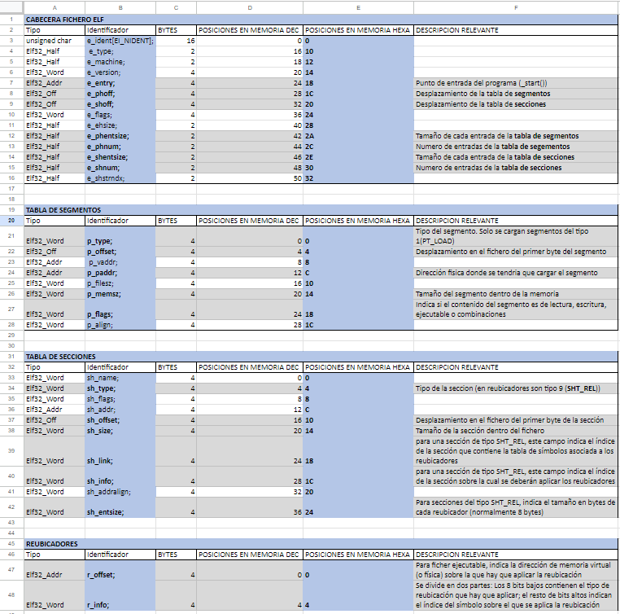

# GarlicOS
## Description
**Micro Kernel for NDS** 

It is divided in three programmers: progP, progM, progG.

# ProgP
In charge of the part of the OS processes

# ProgM
In charge of the part of the OS memory.

Its main task is to load the ELF executable files into memory keeping relocators in mind.

The ELF structure is as it follows (https://docs.google.com/spreadsheets/d/1sdlbWXsLTHNCn0gYQlYk1f1UJhGRCNSU/edit?usp=sharing&ouid=100855027213399620754&rtpof=true&sd=true):

# ProgG
In charge of the graphic part of the OS